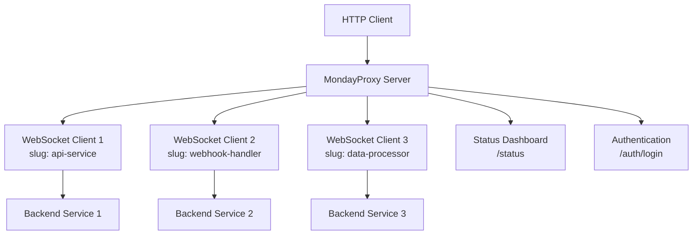
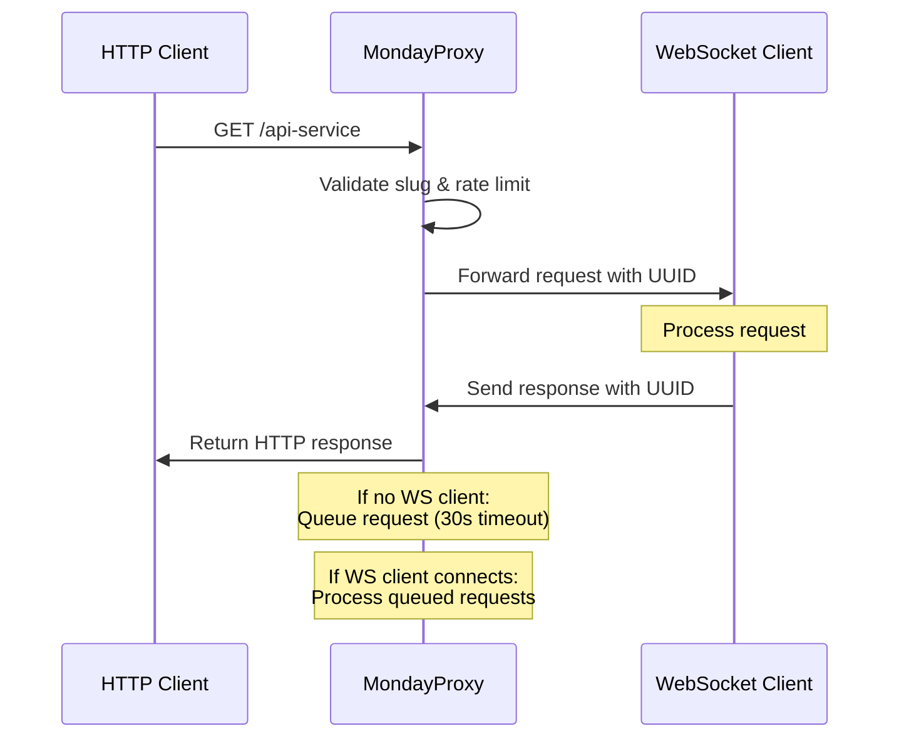

# MondayProxy 🚀

A high-performance Node.js WebSocket proxy server that forwards HTTP requests to WebSocket clients based on URL slugs. Perfect for building real-time APIs, microservices, and distributed systems.

## 🌟 Features

- **🔄 Real-time HTTP-to-WebSocket Proxy**: Forward HTTP requests to WebSocket clients instantly
- **🏷️ Slug-based Routing**: Route requests to specific WebSocket clients using URL slugs
- **⚡ High Performance**: Handles thousands of concurrent requests with minimal latency
- **🔒 Enterprise Security**: JWT authentication, rate limiting, input validation, and security headers
- **📊 Real-time Monitoring**: Live status dashboard with comprehensive metrics
- **💾 Memory Management**: Automatic cleanup and garbage collection for long-running servers
- **🐳 Docker Ready**: Production-ready containerization with security best practices
- **🔧 Highly Configurable**: Extensive environment variable configuration
- **📝 Comprehensive Logging**: Detailed logging with security event tracking
- **🌐 CORS Support**: Configurable Cross-Origin Resource Sharing

## 🏗️ Architecture Overview



## ⏱️ Request Flow Timeline



## 🚀 Quick Start

### Installation

```bash
# Clone the repository
git clone https://github.com/yourusername/mondayproxy.git
cd mondayproxy

# Install dependencies
npm install

# Start the server
npm start
```

The server will start on `http://localhost:3000` with:
- **WebSocket endpoint**: `ws://localhost:3000/ws`
- **Status dashboard**: `http://localhost:3000/status`
- **Authentication**: `http://localhost:3000/auth/login`

### Basic WebSocket Client Registration

```javascript
const WebSocket = require('ws');

const ws = new WebSocket('ws://localhost:3000/ws');

ws.on('open', () => {
  // Register with a slug
  ws.send(JSON.stringify({
    slug: 'my-service'
  }));
});

ws.on('message', (data) => {
  const message = JSON.parse(data.toString());
  
  if (message.request) {
    // Handle incoming HTTP request
    console.log('Received request:', message.request);
    
    // Send response
    ws.send(JSON.stringify({
      slug: message.slug,
      requestId: message.requestId,
      response: {
        statusCode: 200,
        headers: {
          'Content-Type': 'application/json'
        },
        body: JSON.stringify({ message: 'Hello from WebSocket!' })
      }
    }));
  }
});
```

## 🐍 Python WebSocket Client

### Installation

```bash
pip install websockets asyncio
```

### Complete Python Client Example

```python
import asyncio
import websockets
import json
import uuid
from typing import Dict, Any

class MondayProxyClient:
    def __init__(self, server_url: str, slug: str):
        self.server_url = server_url
        self.slug = slug
        self.websocket = None
        self.running = False
    
    async def connect(self):
        """Connect to MondayProxy server and register slug"""
        try:
            self.websocket = await websockets.connect(self.server_url)
            self.running = True
            
            # Register with slug
            await self.websocket.send(json.dumps({
                "slug": self.slug
            }))
            
            print(f"✅ Connected to MondayProxy with slug: {self.slug}")
            
            # Start listening for messages
            await self.listen_for_messages()
            
        except Exception as e:
            print(f"❌ Connection failed: {e}")
    
    async def listen_for_messages(self):
        """Listen for incoming requests from MondayProxy"""
        try:
            async for message in self.websocket:
                data = json.loads(message)
                
                if "request" in data:
                    await self.handle_request(data)
                elif "error" in data:
                    print(f"❌ Server error: {data['error']}")
                else:
                    print(f"📨 Received: {data}")
                    
        except websockets.exceptions.ConnectionClosed:
            print("🔌 Connection closed")
            self.running = False
        except Exception as e:
            print(f"❌ Error listening: {e}")
            self.running = False
    
    async def handle_request(self, data: Dict[str, Any]):
        """Handle incoming HTTP request"""
        request_id = data["requestId"]
        request_data = data["request"]
        
        print(f"📥 Handling request {request_id}:")
        print(f"   Method: {request_data['method']}")
        print(f"   URL: {request_data['url']}")
        print(f"   Headers: {request_data['headers']}")
        print(f"   Body: {request_data['body']}")
        
        # Process the request (your business logic here)
        response_body = await self.process_request(request_data)
        
        # Send response back to MondayProxy
        response = {
            "slug": self.slug,
            "requestId": request_id,
            "response": {
                "statusCode": 200,
                "headers": {
                    "Content-Type": "application/json",
                    "X-Processed-By": "Python-Client"
                },
                "body": json.dumps(response_body)
            }
        }
        
        await self.websocket.send(json.dumps(response))
        print(f"📤 Sent response for request {request_id}")
    
    async def process_request(self, request_data: Dict[str, Any]) -> Dict[str, Any]:
        """Process the HTTP request and return response data"""
        # Example processing logic
        if request_data["method"] == "GET":
            return {
                "message": f"Hello from Python client!",
                "slug": self.slug,
                "method": request_data["method"],
                "timestamp": asyncio.get_event_loop().time()
            }
        elif request_data["method"] == "POST":
            try:
                body_data = json.loads(request_data["body"]) if request_data["body"] else {}
                return {
                    "message": "POST request processed",
                    "received_data": body_data,
                    "slug": self.slug
                }
            except json.JSONDecodeError:
                return {
                    "error": "Invalid JSON in request body",
                    "slug": self.slug
                }
        else:
            return {
                "error": f"Unsupported method: {request_data['method']}",
                "slug": self.slug
            }
    
    async def disconnect(self):
        """Disconnect from MondayProxy"""
        if self.websocket:
            await self.websocket.close()
            self.running = False
            print("🔌 Disconnected from MondayProxy")

# Usage example
async def main():
    client = MondayProxyClient("ws://localhost:3000/ws", "python-service")
    
    try:
        await client.connect()
    except KeyboardInterrupt:
        print("\n🛑 Shutting down...")
        await client.disconnect()

if __name__ == "__main__":
    asyncio.run(main())
```

## 🎮 Unity C# WebSocket Client

### Installation

Add the following packages to your Unity project via Package Manager:
- **WebSocketSharp** (via Package Manager or Asset Store)
- **Newtonsoft.Json** (via Package Manager)

### Complete Unity C# Client

```csharp
using System;
using System.Collections;
using System.Collections.Generic;
using System.Text;
using UnityEngine;
using WebSocketSharp;
using Newtonsoft.Json;

[System.Serializable]
public class RequestData
{
    public string method;
    public string url;
    public Dictionary<string, string> headers;
    public string body;
}

[System.Serializable]
public class WebSocketMessage
{
    public string slug;
    public string requestId;
    public RequestData request;
    public ResponseData response;
}

[System.Serializable]
public class ResponseData
{
    public int statusCode;
    public Dictionary<string, string> headers;
    public string body;
}

[System.Serializable]
public class ResponseMessage
{
    public string slug;
    public string requestId;
    public ResponseData response;
}

public class MondayProxyClient : MonoBehaviour
{
    [Header("Connection Settings")]
    public string serverUrl = "ws://localhost:3000/ws";
    public string slug = "unity-service";
    
    [Header("Debug")]
    public bool enableDebugLogs = true;
    
    private WebSocket webSocket;
    private bool isConnected = false;
    private Dictionary<string, DateTime> pendingRequests = new Dictionary<string, DateTime>();
    
    void Start()
    {
        ConnectToServer();
    }
    
    void ConnectToServer()
    {
        try
        {
            webSocket = new WebSocket(serverUrl);
            
            // Set up event handlers
            webSocket.OnOpen += OnWebSocketOpen;
            webSocket.OnMessage += OnWebSocketMessage;
            webSocket.OnError += OnWebSocketError;
            webSocket.OnClose += OnWebSocketClose;
            
            // Connect
            webSocket.Connect();
            
            LogDebug("🔌 Attempting to connect to MondayProxy...");
        }
        catch (Exception e)
        {
            LogError($"❌ Failed to create WebSocket connection: {e.Message}");
        }
    }
    
    void OnWebSocketOpen(object sender, EventArgs e)
    {
        isConnected = true;
        LogDebug("✅ Connected to MondayProxy server");
        
        // Register with slug
        var registrationMessage = new { slug = slug };
        string jsonMessage = JsonConvert.SerializeObject(registrationMessage);
        webSocket.Send(jsonMessage);
        
        LogDebug($"📝 Registered with slug: {slug}");
    }
    
    void OnWebSocketMessage(object sender, MessageEventArgs e)
    {
        try
        {
            string message = e.Data;
            LogDebug($"📨 Received message: {message}");
            
            var wsMessage = JsonConvert.DeserializeObject<WebSocketMessage>(message);
            
            if (wsMessage.request != null)
            {
                HandleIncomingRequest(wsMessage);
            }
            else if (wsMessage.response != null)
            {
                LogDebug($"📤 Received response for request: {wsMessage.requestId}");
            }
            else
            {
                LogDebug($"📋 Received other message: {message}");
            }
        }
        catch (Exception ex)
        {
            LogError($"❌ Error processing message: {ex.Message}");
        }
    }
    
    void OnWebSocketError(object sender, ErrorEventArgs e)
    {
        LogError($"❌ WebSocket error: {e.Message}");
        isConnected = false;
    }
    
    void OnWebSocketClose(object sender, CloseEventArgs e)
    {
        LogDebug($"🔌 WebSocket connection closed: {e.Reason}");
        isConnected = false;
        
        // Attempt to reconnect after 5 seconds
        Invoke(nameof(ConnectToServer), 5f);
    }
    
    void HandleIncomingRequest(WebSocketMessage message)
    {
        string requestId = message.requestId;
        RequestData requestData = message.request;
        
        LogDebug($"📥 Handling request {requestId}:");
        LogDebug($"   Method: {requestData.method}");
        LogDebug($"   URL: {requestData.url}");
        LogDebug($"   Body: {requestData.body}");
        
        // Track request start time
        pendingRequests[requestId] = DateTime.Now;
        
        // Process request on main thread
        StartCoroutine(ProcessRequestCoroutine(requestId, requestData));
    }
    
    IEnumerator ProcessRequestCoroutine(string requestId, RequestData requestData)
    {
        // Simulate processing time (remove in production)
        yield return new WaitForSeconds(0.1f);
        
        ResponseData response = ProcessRequest(requestData);
        SendResponse(requestId, response);
        
        // Remove from pending requests
        pendingRequests.Remove(requestId);
    }
    
    ResponseData ProcessRequest(RequestData requestData)
    {
        ResponseData response = new ResponseData();
        
        try
        {
            switch (requestData.method.ToUpper())
            {
                case "GET":
                    response = HandleGetRequest(requestData);
                    break;
                case "POST":
                    response = HandlePostRequest(requestData);
                    break;
                case "PUT":
                    response = HandlePutRequest(requestData);
                    break;
                case "DELETE":
                    response = HandleDeleteRequest(requestData);
                    break;
                default:
                    response = CreateErrorResponse(405, "Method not allowed");
                    break;
            }
        }
        catch (Exception e)
        {
            LogError($"❌ Error processing request: {e.Message}");
            response = CreateErrorResponse(500, "Internal server error");
        }
        
        return response;
    }
    
    ResponseData HandleGetRequest(RequestData requestData)
    {
        var responseData = new
        {
            message = "Hello from Unity!",
            slug = slug,
            method = requestData.method,
            url = requestData.url,
            timestamp = DateTime.Now.ToString("yyyy-MM-dd HH:mm:ss"),
            unityVersion = Application.unityVersion,
            platform = Application.platform.ToString()
        };
        
        return new ResponseData
        {
            statusCode = 200,
            headers = new Dictionary<string, string>
            {
                { "Content-Type", "application/json" },
                { "X-Processed-By", "Unity-Client" },
                { "X-Unity-Version", Application.unityVersion }
            },
            body = JsonConvert.SerializeObject(responseData, Formatting.Indented)
        };
    }
    
    ResponseData HandlePostRequest(RequestData requestData)
    {
        try
        {
            var requestBody = JsonConvert.DeserializeObject(requestData.body);
            
            var responseData = new
            {
                message = "POST request processed successfully",
                receivedData = requestBody,
                slug = slug,
                processedAt = DateTime.Now.ToString("yyyy-MM-dd HH:mm:ss")
            };
            
            return new ResponseData
            {
                statusCode = 200,
                headers = new Dictionary<string, string>
                {
                    { "Content-Type", "application/json" },
                    { "X-Processed-By", "Unity-Client" }
                },
                body = JsonConvert.SerializeObject(responseData, Formatting.Indented)
            };
        }
        catch (Exception e)
        {
            return CreateErrorResponse(400, $"Invalid JSON: {e.Message}");
        }
    }
    
    ResponseData HandlePutRequest(RequestData requestData)
    {
        var responseData = new
        {
            message = "PUT request processed",
            slug = slug,
            updatedAt = DateTime.Now.ToString("yyyy-MM-dd HH:mm:ss")
        };
        
        return new ResponseData
        {
            statusCode = 200,
            headers = new Dictionary<string, string>
            {
                { "Content-Type", "application/json" },
                { "X-Processed-By", "Unity-Client" }
            },
            body = JsonConvert.SerializeObject(responseData, Formatting.Indented)
        };
    }
    
    ResponseData HandleDeleteRequest(RequestData requestData)
    {
        var responseData = new
        {
            message = "DELETE request processed",
            slug = slug,
            deletedAt = DateTime.Now.ToString("yyyy-MM-dd HH:mm:ss")
        };
        
        return new ResponseData
        {
            statusCode = 200,
            headers = new Dictionary<string, string>
            {
                { "Content-Type", "application/json" },
                { "X-Processed-By", "Unity-Client" }
            },
            body = JsonConvert.SerializeObject(responseData, Formatting.Indented)
        };
    }
    
    ResponseData CreateErrorResponse(int statusCode, string message)
    {
        var errorData = new
        {
            error = message,
            slug = slug,
            timestamp = DateTime.Now.ToString("yyyy-MM-dd HH:mm:ss")
        };
        
        return new ResponseData
        {
            statusCode = statusCode,
            headers = new Dictionary<string, string>
            {
                { "Content-Type", "application/json" }
            },
            body = JsonConvert.SerializeObject(errorData, Formatting.Indented)
        };
    }
    
    void SendResponse(string requestId, ResponseData response)
    {
        if (!isConnected || webSocket == null)
        {
            LogError("❌ Cannot send response: WebSocket not connected");
            return;
        }
        
        var responseMessage = new ResponseMessage
        {
            slug = slug,
            requestId = requestId,
            response = response
        };
        
        string jsonResponse = JsonConvert.SerializeObject(responseMessage);
        webSocket.Send(jsonResponse);
        
        LogDebug($"📤 Sent response for request {requestId} (Status: {response.statusCode})");
    }
    
    void LogDebug(string message)
    {
        if (enableDebugLogs)
        {
            Debug.Log($"[MondayProxy] {message}");
        }
    }
    
    void LogError(string message)
    {
        Debug.LogError($"[MondayProxy] {message}");
    }
    
    void OnDestroy()
    {
        if (webSocket != null)
        {
            webSocket.Close();
        }
    }
    
    void OnApplicationPause(bool pauseStatus)
    {
        if (pauseStatus && webSocket != null)
        {
            webSocket.Close();
        }
        else if (!pauseStatus && !isConnected)
        {
            ConnectToServer();
        }
    }
    
    void OnApplicationFocus(bool hasFocus)
    {
        if (!hasFocus && webSocket != null)
        {
            webSocket.Close();
        }
        else if (hasFocus && !isConnected)
        {
            ConnectToServer();
        }
    }
}
```

## 🔧 Configuration

### Environment Variables

```bash
# Server Configuration
PORT=3000
NODE_ENV=production

# Security Configuration
JWT_SECRET=your-super-secret-jwt-key-change-this-in-production
REQUIRE_AUTH=true
ADMIN_PASSWORD=your-secure-admin-password

# Rate Limiting
ENABLE_RATE_LIMIT=true
MAX_CONNECTIONS_PER_IP=10
MAX_REQUESTS_PER_MINUTE=100

# Security
ALLOWED_ORIGINS=https://yourdomain.com,https://anotherdomain.com
SLUG_WHITELIST=api-service,webhook-handler,data-processor
MAX_REQUEST_SIZE=10485760  # 10MB

# CORS
ENABLE_CORS=true

# Memory Management
MAX_LOGS=1000
LOG_RETENTION_DAYS=7
STATS_RETENTION_DAYS=30
```

## 🐳 Docker Deployment

### Build and Run

```bash
# Build Docker image
docker build -t mondayproxy .

# Run with environment variables
docker run -d \
  --name mondayproxy \
  -p 3000:3000 \
  -e JWT_SECRET="$(openssl rand -base64 32)" \
  -e ADMIN_PASSWORD="$(openssl rand -base64 16)" \
  -e REQUIRE_AUTH=true \
  -e ENABLE_RATE_LIMIT=true \
  mondayproxy
```

## 📊 Monitoring & Status

### Status Dashboard

Access the real-time status dashboard at `http://localhost:3000/status`:

- **🟢 Server Status**: Online/offline indicator with uptime
- **📊 Active Clients**: Live list of connected WebSocket clients
- **📈 Statistics**: Request counts, response times, success rates
- **📝 Real-time Logs**: Live log stream with color coding
- **🔒 Security Events**: Failed logins, rate limit violations
- **💾 Memory Usage**: Heap usage and cleanup statistics

## 🔒 Security Features

### Authentication & Authorization
- **JWT-based authentication** for admin access
- **Password-protected status page**
- **Slug whitelist** for authorized services only
- **Token expiration** and secure storage

### Input Validation & Protection
- **Request size limits** (10MB default)
- **Header sanitization** (removes dangerous headers)
- **XSS protection** with pattern detection
- **Path traversal protection**
- **JSON injection prevention**

### Rate Limiting & DDoS Protection
- **Per-IP request limits** (100 requests/minute)
- **WebSocket connection limits** (10 connections/IP)
- **Automatic cleanup** of rate limit data
- **Configurable limits** via environment variables

## 🚀 Production Deployment

### Prerequisites
- Node.js 18+ or Docker
- Reverse proxy (nginx/Apache) for HTTPS
- SSL/TLS certificates
- Firewall configuration

### Security Checklist
- [ ] Change default passwords
- [ ] Set strong JWT secret
- [ ] Enable authentication
- [ ] Configure rate limiting
- [ ] Set up slug whitelist
- [ ] Enable HTTPS/WSS
- [ ] Configure firewall rules
- [ ] Set up monitoring
- [ ] Test security features
- [ ] Review security logs

## 📚 Additional Resources

- **[Security Guide](SECURITY.md)**: Comprehensive security documentation
- **[Memory Management](MEMORY_MANAGEMENT.md)**: Memory optimization and leak prevention
- **[API Documentation](docs/API.md)**: Complete API reference
- **[Troubleshooting](docs/TROUBLESHOOTING.md)**: Common issues and solutions

## 🤝 Contributing

1. Fork the repository
2. Create a feature branch (`git checkout -b feature/amazing-feature`)
3. Commit your changes (`git commit -m 'Add amazing feature'`)
4. Push to the branch (`git push origin feature/amazing-feature`)
5. Open a Pull Request

## 📄 License

This project is licensed under the MIT License - see the [LICENSE](LICENSE) file for details.

---

**MondayProxy** - The modern way to bridge HTTP and WebSocket protocols! 🚀